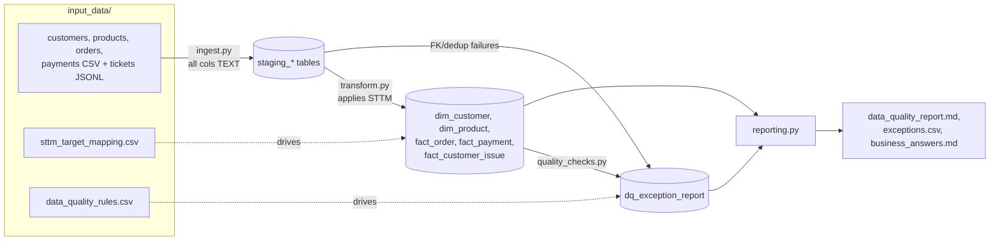

# Plan: Data profiling + implementation plan for OmniRetail pipeline

## Context

OmniRetail is preparing a customer-360 / order-reconciliation initiative. The
raw inputs come from disconnected systems and (per `business_context.md`) are
known to contain duplicate customers, inconsistent geography, invalid foreign
keys, payment mismatches, malformed timestamps, and bad order quantities.

This task is **planning only**. The deliverable is a single file, **`PLAN.md`**
at the repo root, containing (a) a read-only data-quality audit of every file in
`input_data/`, and (b) an implementation plan that derives the curated schema
from `sttm_target_mapping.csv` and the DQ checks from `data_quality_rules.csv`.
**No pipeline code is written in this task.** The existing `src/`, `sql/`,
`tests/`, `outputs/` files are one-line stubs; CLAUDE.md already fixes the
architecture (stdlib `sqlite3`, DB at `outputs/curated.sqlite`, TEXT staging,
`dq_exception_report` table, no silent drops).

Confirmed decisions with the user:
- **Dedup:** collapse exact duplicate `customer_id` AND treat rows sharing
  `full_name` + (`phone` OR `email`) as the same person, via a crosswalk that
  remaps downstream FKs.
- **Stack:** stdlib `csv`/`json`/`sqlite3` only (more performant here, honors
  CLAUDE.md). Trim `pandas` from `requirements.txt`.

---

## Part A — Data audit to embed in PLAN.md

The audit below is the verified content (already computed from the files) that
PLAN.md must contain.

### customers.csv — 20 data rows, 9 columns
Columns: customer_id, first_name, last_name, email, phone, country, state, signup_date, loyalty_tier
- **Null rates:** email 1/20 (5%, C004); phone 2/20 (10%, C003, C017); all else 0%.
- Issues:
  - **Duplicate customer_id:** `C006` appears twice (rows differ: email
    `mason.davis@` vs `mason.d@`, state `New York` vs `NY`, phone `…0170` vs `…0171`). → DQ001.
  - **Cross-ID duplicate:** `C001` and `C019` are both "Ava Patel" sharing phone
    `312-555-0101`. (Note `C016` Henry Martin reuses the same phone, so phone
    alone is unsafe — match requires name + phone/email.) → DQ001.
  - **Country variants:** `USA`, `US`, `United States` → standardize to USA. → DQ003.
  - **State variants:** full names (`Illinois`, `New York`, `Texas`, `Florida`)
    mixed with codes (IL, NY, TX, FL, CA, MA, WA). → DQ003.
  - **Mixed signup_date formats:** `2025-01-04`, `01/12/2025`, `2025/01/14`, `03-06-2025`.
  - **Missing email:** C004 (flag, do not fabricate). → DQ002.

### products.csv — 11 data rows, 5 columns
Columns: product_id, product_name, category, unit_price, active_flag
- **Null rates:** 0% across all columns.
- Issues:
  - **Inactive product sold:** `P011` (Protein Bar Box) has `active_flag=N` but is
    referenced by completed order `O1015`.
  - `unit_price` stored as TEXT → cast to decimal.

### orders.csv — 31 data rows (30 unique order_ids), 8 columns
Columns: order_id, customer_id, order_ts, product_id, quantity, order_status, shipping_state, order_total
- **Null rates:** 0%.
- Issues:
  - **Duplicate order_id:** `O1018` appears twice (identical). → DQ004.
  - **Invalid customer FK:** `O1019` → `C999` (not in customers). → DQ005.
  - **Invalid product FK:** `O1020` → `P999` (not in products). → DQ006.
  - **Negative/suspicious quantity:** `O1030` quantity `-1`, total `-21.00`,
    status `completed`. → DQ007.
  - **order_total mismatch:** `O1021` total `50.00` but P008 4×11.00 = `44.00`.
    (Payment for O1021 is 44.00, matching the computed value, not the stated total.) → DQ008.
  - **Mixed order_ts formats:** `2025-03-01 10:15:00`, `03/02/2025 14:20`,
    `2025/03/03 09:00`, `2025-03-05T16:45:00Z`, `05-06-2025 16:30`.
  - **shipping_state variants:** same code/full-name inconsistency as customers.

### payments.csv — 30 data rows, 6 columns
Columns: payment_id, order_id, payment_ts, payment_method, payment_status, amount
- **Null rates:** 0%.
- Issues:
  - **Orphan payment:** `PMT029` → `O9999` (no such order). → DQ009.
  - **Missing payment:** order `O1024` (completed) has no payment row → surfaces
    in business Q3 (missing payments).
  - **Settled ≠ completed total:** `PMT021`/`O1021` settled `44.00` vs order_total
    `50.00`. → DQ010.
  - **Negative settled amount:** `PMT030`/`O1030` settled `-21.00` (tied to the
    negative-qty order).
  - Non-settled rows are legitimately not 1:1 with totals: `PMT005` voided 0.00
    (cancelled O1005), `PMT014` refunded -59.99 (returned O1014).

### support_tickets.jsonl — 10 records, 7 fields
Fields: ticket_id, customer_id, created_ts, channel, category, sentiment, description
- **Null rates:** 0% (all fields present in every record).
- Issues:
  - **Malformed timestamp:** `T010` `created_ts = "bad_timestamp"`. → DQ011.
  - **Invalid customer FK:** `T005` → `C999`. → DQ012.
  - 7 negative-sentiment tickets; several map directly to the exceptions above
    (T004→C006 duplicate, T005→C999, T007→C002/O1021 overcharge, T009→C018/O1030
    negative qty, T003→C014/O1014 return) — basis for business Q5.

---

## Part B — Implementation plan to embed in PLAN.md

Schema and checks are **derived at runtime** from the two driver files, never
hard-coded. Stage flow (orchestrated by `src/pipeline.py`):

### 1. `src/ingest.py`
- Read each CSV with stdlib `csv.DictReader`; read JSONL line-by-line with
  `json.loads`. Create `staging_customers`, `staging_products`, `staging_orders`,
  `staging_payments`, `staging_support_tickets` in `outputs/curated.sqlite` with
  **every column TEXT** (satisfies the TEXT-staging constraint). Load as-is, no cleaning.

### 2. `src/transform.py` — derive curated tables from `sttm_target_mapping.csv`
- Parse `sttm_target_mapping.csv` to build the target-table column lists, so the
  curated DDL/columns come from the mapping, not literals.
- Shared helpers: `parse_timestamp()` (tries `%Y-%m-%d %H:%M:%S`, `%Y-%m-%dT%H:%M:%SZ`,
  `%m/%d/%Y %H:%M`, `%Y/%m/%d %H:%M`, `%m-%d-%Y %H:%M`, date-only variants;
  returns None on failure); `STATE_MAP` (Illinois→IL, New York→NY, Texas→TX,
  Florida→FL, …); `normalize_country()` (USA/US/United States→USA); `to_decimal()`.
- **dim_customer:** dedup in two passes — (a) collapse exact duplicate
  `customer_id` keeping the most-complete row; (b) group rows with equal
  normalized `full_name` AND matching `phone` or `email`, pick lowest
  customer_id as `customer_key`, emit an `id_crosswalk` (old_id→canonical).
  Build `full_name`, lowercased `email` (NULL flagged not fabricated),
  `standard_country`, `standard_state`, preserved `loyalty_tier`.
- **dim_product:** preserve id/name/category, cast `unit_price` decimal. Keep
  `active_flag` available for the inactive-product check.
- **fact_order:** dedup `order_id`; remap `customer_key` through the crosswalk;
  validate customer/product FKs (failures → exception report, **row still kept**
  with NULL key per "no silent drops"); `order_date` via `parse_timestamp`;
  `quantity` int; `gross_order_amount` decimal plus computed `quantity*unit_price`
  for the DQ008 comparison.
- **fact_payment:** preserve `payment_id`; FK `order_key` to fact_order (orphans →
  exception report); `payment_amount` decimal.
- **fact_customer_issue:** `customer_key` via crosswalk (FK where possible),
  preserve `issue_category`, `sentiment`; parse `created_ts` (failures flagged).

### 3. `src/quality_checks.py` — derive checks from `data_quality_rules.csv`
- Read `data_quality_rules.csv` and dispatch each `rule_id` (DQ001–DQ012) to a
  registered check function keyed by `rule_id`, carrying `dataset`/`severity`
  from the file. Each failing record → one row in `dq_exception_report`
  (`rule_id, dataset, record_id, issue_description`). Expected populated failures:
  DQ001 (C006, C001/C019), DQ002 (C004), DQ003 (variant rows), DQ004 (O1018),
  DQ005 (O1019/C999), DQ006 (O1020/P999), DQ007 (O1030), DQ008 (O1021),
  DQ009 (PMT029/O9999), DQ010 (PMT021), DQ011 (T010), DQ012 (T005). Plus a
  derived inactive-product-sold flag for P011/O1015.

### 4. `src/reporting.py` — answer the 5 business questions (no hard-coded values)
- SQL/Python over curated tables: (1) completed revenue by month
  (`strftime('%Y-%m', order_date)` on completed); (2) top 10 customers by
  completed value; (3) orders with payment mismatch / missing payment / invalid
  customer / invalid product / suspicious qty (union from `dq_exception_report` +
  missing-payment anti-join, e.g. O1024); (4) states by completed revenue
  (standardized); (5) join negative-sentiment tickets to exception customers.
- Render `outputs/data_quality_report.md`, `outputs/exceptions.csv`,
  `outputs/business_answers.md`.

### 5. `src/pipeline.py`
- Orchestrate ingest → transform → quality_checks → reporting; (re)create the
  SQLite DB each run for reproducibility.

### 6. `sql/curated_model.sql` & `sql/business_questions.sql`
- Companion DDL + the five analytics queries mirroring the Python logic.

### 7. `tests/test_quality_checks.py`
- One pytest per rule asserting the known offending IDs land in
  `dq_exception_report` (e.g. O1018 for DQ004, O1021 for DQ008/DQ010,
  PMT029 for DQ009, T010 for DQ011).

### 8. `requirements.txt`
- Remove `pandas`; keep `pytest`.

---

## Deliverable & verification for THIS task
- **Only output:** create `PLAN.md` at repo root with Parts A + B above. No code,
  no DB, no pipeline files touched.
- Verify by opening `PLAN.md` and confirming the audit numbers match the source
  files and every DQ rule (DQ001–DQ012) and STTM target column is addressed.
