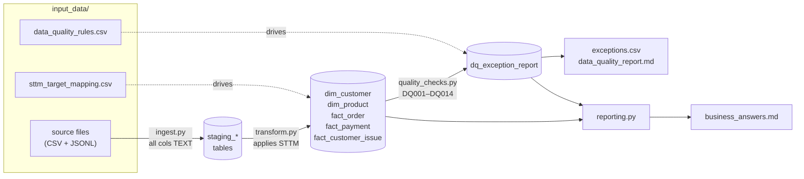

# EXL Take-Home: OmniRetail Data Management Pipeline

A four-stage local data pipeline that ingests, transforms, validates, and reports on OmniRetail's customer-360 / order-reconciliation data. Everything runs locally — no cloud services, no paid APIs, no network calls. The only runtime dependency is `pytest` for running the validation tests.

---

## Setup Instructions

**Prerequisites:** Python 3.9+

1. Clone the repository and navigate to the project root:
   ```bash
   git clone <repo-url>
   cd EXL-TakeHome-Mohi
   ```

2. Create and activate a virtual environment (recommended):
   ```bash
   python -m venv .venv
   source .venv/bin/activate   # Windows: .venv\Scripts\activate
   ```

3. Install dependencies:
   ```bash
   pip install -r requirements.txt
   ```

The `outputs/` directory is created automatically on the first run. No database setup is required — SQLite is part of Python's standard library.

---

## Commands

```bash
# Run the full pipeline (ingest → transform → quality_checks → reporting)
python src/pipeline.py

# Run all tests
pytest tests/
```

After a successful pipeline run, the following output files are produced:

| File | Description |
|---|---|
| `outputs/curated.sqlite` | SQLite database with all five curated tables |
| `outputs/data_quality_report.md` | DQ rule results for DQ001–DQ014 |
| `outputs/exceptions.csv` | Every record that failed a DQ check |
| `outputs/business_answers.md` | Answers to the five business questions |

---

## Dependencies

| Package | Version | Purpose |
|---|---|---|
| `pytest` | ≥ 8.0.0 | Test runner |

The pipeline itself (`src/`) uses **only Python stdlib** (`sqlite3`, `csv`, `json`, `pathlib`, `logging`, `decimal`, `datetime`). No third-party packages are required to run the pipeline.

---

## Approach

### Architecture

The pipeline has four stages orchestrated by `src/pipeline.py`. Each run drops and recreates the SQLite database from scratch, making reruns fully idempotent.



### Design Decisions

**Schema and rules are data-driven, not hard-coded.** `sttm_target_mapping.csv` is the single source of truth for curated table columns; `data_quality_rules.csv` is the single source of truth for DQ logic. Adding a new column or rule means updating those CSVs, not the Python code.

**TEXT staging.** All source columns land in SQLite as TEXT. Type casting (decimals, timestamps, integers) happens exclusively in `transform.py`. This avoids silent truncation or type coercion at load time and makes every raw value inspectable.

**No silent drops.** Every record that fails a foreign-key check or value validation is written to the `dq_exception_report` table and `exceptions.csv` rather than discarded. The row is still kept in the curated table with a NULL key where the FK is invalid. The invariant `raw rows = curated rows + exception rows` is enforced by the test suite.

**stdlib-only pipeline.** The pipeline uses Python's built-in `csv`, `json`, and `sqlite3` modules. `pandas` is intentionally excluded from the pipeline (it is only in `requirements.txt` for the test suite), keeping the runtime dependency surface minimal for a dataset of this size.

### Assumptions

- **Country/state normalization is lossless.** Variants `USA`, `US`, `United States` are all standardized to `USA`; full state names (`Illinois`, `New York`, `Texas`, `Florida`) are mapped to two-letter codes. These are flagged in DQ003 but need no further remediation.
- **`C001` and `C019` are the same person.** Both are "Ava Patel" sharing phone `312-555-0101`. `C019` has no orders, confirming it is a duplicate account. `C001` is kept as the canonical key; `C019` is retired via the crosswalk.
- **Non-settled payments are not mismatches.** Voided (`PMT005`, amount 0.00) and refunded (`PMT014`, amount −59.99) payments are excluded from the DQ010 amount-reconciliation check because they reflect legitimate lifecycle states.
- **DQ013 and DQ014 were added beyond the original rule set.** The base `data_quality_rules.csv` covered DQ001–DQ012. DQ013 (cross-ID duplicate customers resolved via name + contact-info matching) and DQ014 (completed order referencing a discontinued product) were identified during the data audit and added manually to make the rule file the complete source of truth.
- **`suggested_action` column was added to `data_quality_rules.csv`.** The original file had no remediation guidance. A `suggested_action` column was added so that actionable next steps are co-located with each rule and surfaced directly in `data_quality_report.md`. Rules where normalization is handled automatically by the pipeline (e.g. DQ001, DQ003) have their suggested action left blank.


### Trade-offs

| Decision | Upside | Downside |
|---|---|---|
| SQLite over DuckDB | Pure stdlib, no external dependencies | Not suitable for large-scale or concurrent workloads |
| SQL over pandas for transformations | Simpler and more performant for a small dataset; no extra dependency | Less ergonomic for complex column-level transformations at scale |
| Full DB rebuild on every run | Fully idempotent, no stale state | Slow for very large datasets; no incremental loading |
| Two-pass dedup in Python | Handles complex cross-ID matching | More code than a single SQL DISTINCT |

### Known Limitations

- **Scale:** The pipeline is designed for the provided dataset (~20–30 rows per table). Loading millions of rows via `csv.DictReader` into SQLite without batching would be slow.
- **Timestamp parsing:** `parse_timestamp()` covers the six observed formats. Unknown formats surface as `NULL` and are flagged by DQ011 — there is no fuzzy fallback.
- **Dedup is deterministic but opinionated:** The "lowest customer_id wins" canonical selection is arbitrary. In production this decision would need a business rule (e.g., most-recent signup, highest loyalty tier).
- **No incremental runs:** Every execution drops and recreates the database. There is no support for appending new source files without reprocessing everything.

### Next Improvements

1. **Incremental loading:** Add a watermark / change-data-capture layer so only new or updated records are processed rather than full reloads.
2. **Configurable dedup rules:** Expose the match keys (`full_name + phone/email`) and canonical-selection strategy as parameters in `sttm_target_mapping.csv` rather than embedding them in code.
3. **Streaming ingest for large files:** Replace `csv.DictReader` full-load with chunked reads and batched SQLite `executemany` inserts to handle larger source files.
5. **Richer DQ reporting:** Add trend tracking so repeated pipeline runs can show whether exception counts are improving or worsening over time.

---

## Development Process

The project was built iteratively using **Claude Code (Sonnet 4.6 / Opus 4.7)**:

1. **Bootstrapped** the repository structure and created `CLAUDE.md` (using `/init`) to provide Claude Code with hard constraints — SQLite only, TEXT staging, no silent drops, schema derived from `sttm_target_mapping.csv`.
2. **Generated the implementation plan** using `/ultraplan` with Opus 4.7 at maximum effort. The plan (`PLAN.md`) includes a full data-quality audit of every source file and a stage-by-stage implementation blueprint. The plan was updated manually as decisions were made (dedup strategy, inactive-product handling).
3. **Executed each stage** by feeding the relevant section of `PLAN.md` to Claude Code, verifying the output after each step, and committing. When a generated script deviated from the plan (e.g., the first `transform.py` attempt hard-coded column names), it was rejected and re-prompted with explicit grounding in the plan.
4. **Manual interventions** included: updating `sttm_target_mapping.csv` to match the assessment's target schema, removing auto-generated population SQL from `curated_model.sql`, and adjusting suggested DQ actions that recommended no-op changes.

Full details of each task, prompt, accepted/rejected outputs, and manual fixes are in [`AI_USAGE.md`](AI_USAGE.md). The generated plan is in [`PLAN.md`](PLAN.md).
